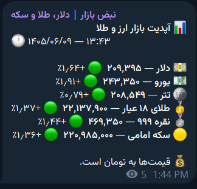

[🇬🇧 English](./README.md) | 🇮🇷 فارسی
# ربات قیمت ارز، طلا و سکه تلگرام

ربات تلگرام برای نمایش قیمت ارز، طلا، نقره و سکه با استفاده از **Cloudflare Workers**، **Cloudflare D1** و چند منبع قیمت با قابلیت Fallback.

## امکانات

- نمایش قیمت دلار، یورو، تتر، طلای ۱۸ عیار، نقره ۹۹۹ و سکه امامی
- نمایش درصد تغییر قیمت
- ارسال خودکار قیمت‌ها در کانال
- دستور `/price`
- پنل مدیریت تلگرام
- Webhook تلگرام
- اجرای 24/7 روی Cloudflare Workers
- ذخیره تنظیمات و وضعیت در D1
- منابع قیمت: Nerkh.io، TGJU و Navasan/GitHub
- مدیریت سهمیه Nerkh با Cache و Cooldown
- Fallback خودکار هنگام خطای یک منبع

## نمونه خروجی




## پیش‌نیازها

- Node.js
- npm
- حساب Cloudflare
- ربات تلگرام ساخته‌شده با BotFather
- Wrangler
- کانال یا گروه تلگرام

## نصب

```bash
git clone https://github.com/A-F-Rashidi/telegram-price-bot.git
cd telegram-price-bot
npm install
```

## تنظیم متغیرهای محیطی

فایل `.dev.vars` را در ریشه پروژه بسازید:

```env
TELEGRAM_BOT_TOKEN="YOUR_TELEGRAM_BOT_TOKEN"
TELEGRAM_CHAT_ID="YOUR_TELEGRAM_CHAT_ID"
TELEGRAM_WEBHOOK_SECRET="YOUR_RANDOM_WEBHOOK_SECRET"
TELEGRAM_ADMIN_USER_ID="YOUR_TELEGRAM_NUMERIC_USER_ID"
NERKH_API_TOKEN=""
```

## ورود به Cloudflare

```bash
npx wrangler login --device
npx wrangler whoami
```

## ساخت D1

```bash
npx wrangler d1 create telegram-price-bot-db
```

شناسه دیتابیس را در `wrangler.jsonc` قرار دهید:

```json
{
  "d1_databases": [
    {
      "binding": "DB",
      "database_name": "telegram-price-bot-db",
      "database_id": "YOUR_DATABASE_ID"
    }
  ]
}
```

سپس:

```bash
npx wrangler d1 execute DB --remote --file=./schema.sql
```

## ثبت Secretها

```bash
npx wrangler secret bulk .dev.vars
npx wrangler secret put WEBHOOK_SETUP_SECRET
```

## Deploy

```bash
npx wrangler deploy
```

آدرس Worker چیزی شبیه این خواهد بود:

```text
https://telegram-price-bot-multisource.YOUR-SUBDOMAIN.workers.dev
```

Health Check:

```text
https://YOUR-WORKER.workers.dev/health
```

## تنظیم Webhook تلگرام

در PowerShell:

```powershell
$WORKER="https://YOUR-WORKER.workers.dev"
$ADMIN="YOUR_WEBHOOK_SETUP_SECRET"

Invoke-RestMethod `
  -Method Post `
  -Uri "$WORKER/admin/setup-webhook" `
  -Headers @{ Authorization = "Bearer $ADMIN" }
```

بررسی وضعیت:

```powershell
Invoke-RestMethod `
  -Uri "$WORKER/admin/webhook-status" `
  -Headers @{ Authorization = "Bearer $ADMIN" } |
  ConvertTo-Json -Depth 6
```

## Cron

نمونه Cron:

```json
{
  "triggers": {
    "crons": ["* * * * *"]
  }
}
```

Worker هر دقیقه اجرا می‌شود، اما Nerkh در هر اجرا صدا زده نمی‌شود. برای کنترل سهمیه از Cache و Cooldown استفاده می‌شود.

## منابع قیمت

### Nerkh.io

Endpointهای اصلی:

```text
/v1/prices/json/currency
/v1/prices/json/gold
/v1/prices/json/crypto
```

در صورت `QUOTA_EXCEEDED` ربات وارد Cooldown می‌شود و از Fallback استفاده می‌کند.

### TGJU

منبع جایگزین برای تکمیل یا جایگزینی قیمت‌ها.

### Navasan / GitHub

Fallbackهای تکمیلی برای ادامه کار ربات.

## اجرای محلی روی ویندوز

```bash
npx wrangler dev
```

یا:

```text
RUN-WINDOWS.cmd
RUN-CRON-LOCAL.cmd
```

آدرس محلی:

```text
http://127.0.0.1:8787
```

## تست

```bash
npm test
```

## انتقال به حساب Cloudflare دیگر

```bash
npx wrangler logout
npx wrangler login --device
npx wrangler d1 create telegram-price-bot-db
```

بعد `database_id` جدید را در `wrangler.jsonc` بگذارید، Schema و Secretها را اعمال کنید و دوباره Deploy بزنید.

## لایسنس

این پروژه طبق فایل `LICENSE` منتشر می‌شود.

## مشارکت

Pull Request و Issue برای پیشنهادها و گزارش باگ خوش‌آمد هستند.
